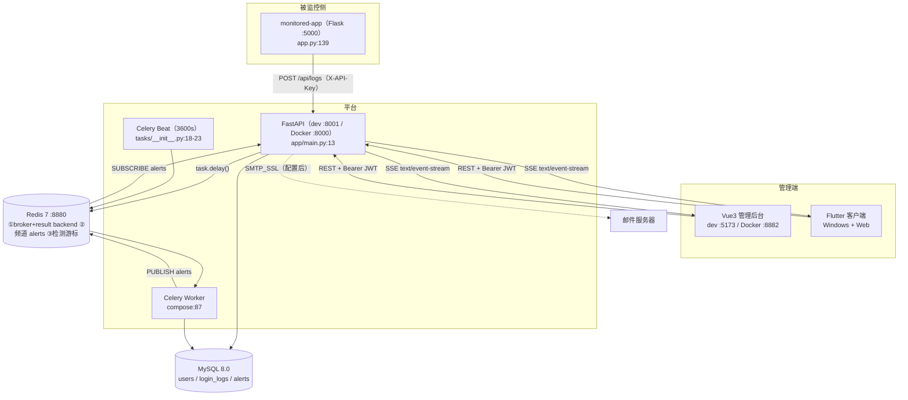
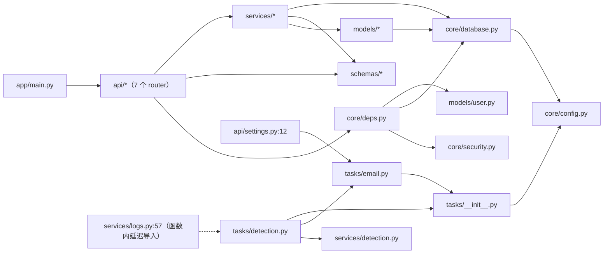
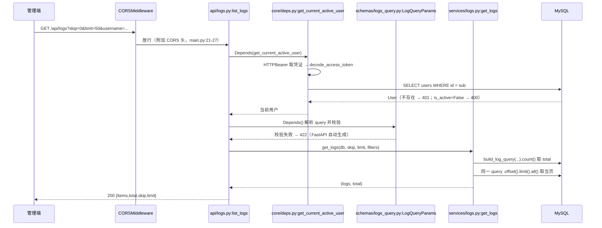

# 5. 系统架构 ｜ 6. 项目目录结构

## 5. 系统架构

### 5.1 运行时架构

下图中每个节点都可在源码中定位，未在源码出现的组件不画。



### 5.2 分层结构

```text
HTTP 层      api/*.py            路由声明、依赖注入、HTTP 状态码
校验层       schemas/*.py        Pydantic 请求/响应模型（from_attributes 直出 ORM）
业务层       services/*.py       认证、日志落库、异常检测规则、告警去重
数据层       models/*.py         SQLAlchemy 2.0 声明式模型
            core/database.py     engine / SessionLocal / get_db
异步侧支     tasks/*.py          Celery 实例、实时检测、定时检测、邮件
横切         core/{config,deps,security}.py
```

约定（源码事实）：

- **无 DTO 转换层**：`services` 直接返回 ORM 对象，由 `response_model` + `model_config = ConfigDict(from_attributes=True)` 序列化（例：`schemas/alert.py:26`）。这是项目的已知结构边界（`docs/DESIGN.md:146` 有说明）。
- **`services/detection.py` 被两侧复用**：实时任务（传 `log_id`）与定时任务（不传）共用同一函数，仅时间窗口终点不同（`services/detection.py:31-39,100-106`）。

### 5.3 模块依赖关系



- 依赖方向单向、无环；唯一的「回指」在 `services/logs.py:57`，用**函数体内延迟导入**打破 `services ↔ tasks` 循环。
- `app/core/redis.py`（定义 `redis_client`）**不在依赖图中**：经 grep 核实全仓零引用，是死代码；真实客户端在 `tasks/detection.py:19,31` 现场创建。保留该文件会造成「以为有现成 Redis 客户端」的误导。

### 5.4 请求生命周期（以 `GET /api/logs` 为例）



关键实现细节（源码事实）：

1. 筛选逻辑集中在 `services/logs.py:11-33`；`username` 用 `contains()`（SQL `LIKE %x%`），`ip_address` 用等值匹配，排序固定 `login_time DESC`（`:33`，**无排序参数**）。
2. 计数与取数分两次查询（`services/logs.py:44-45`），`total` 与当页数据非同一快照。
3. 鉴权失败共 4 条分支（`core/deps.py:18-45`、`:54-58`）。

### 5.5 控制流要点

- **上报接口是唯一不需要登录的写入入口**，靠 `X-API-Key` 静态密钥鉴权（`core/deps.py:62-69`），明文常量比较。
- **实时检测不在请求线程内执行**，但**入队动作**在请求线程内（`services/logs.py:58`），因此 Redis 的可用性直接决定上报接口能否返回（见 `11-性能分析.md` PERF-00）。
- **SSE 长连接**在 `api/notifications.py:31-36` 持有请求级数据库会话，连接生命周期等于流的生命周期（`core/database.py:11-16` 的 `finally` 在流结束后才执行）。

## 6. 项目目录结构

### 6.1 顶层结构

```text
E:/实习/
├── backend/                  # 后端服务（FastAPI + Celery）         【核心代码】
│   ├── app/
│   │   ├── main.py           # FastAPI 装配 + CORS + 7 路由注册      【入口】
│   │   ├── api/              # 7 个 router 文件                      【核心代码】
│   │   ├── core/             # config/database/deps/security/redis    【基础设施】
│   │   ├── models/           # 3 个 ORM 模型（须在 __init__ 登记）    【核心代码】
│   │   ├── schemas/          # 5 个 Pydantic 模式文件                【核心代码】
│   │   ├── services/         # auth/logs/detection                   【核心代码】
│   │   ├── tasks/            # Celery 实例 + 检测 + 邮件             【核心代码·异步侧支】
│   │   └── utils/            # 空包（仅 __init__.py）                【占位】
│   ├── alembic/              # env.py + versions/（3 个迁移）        【数据库迁移】
│   ├── scripts/              # seed / seed_logs / mock / smoke       【工具】
│   ├── tests/                # conftest + 5 个测试文件（42 用例）     【测试】
│   ├── Dockerfile · docker-entrypoint.sh                            【入口·基础设施】
│   ├── requirements.txt · pyproject.toml · alembic.ini              【依赖/配置】
│   └── .env · .env.example · .dockerignore                          【配置】
├── frontend/                 # Vue3 管理后台                         【核心代码】
│   ├── src/{api,components,composables,layouts,router,stores,utils,views}
│   ├── nginx.conf            # 生产静态托管 + /api 反代              【部署配置】
│   ├── Dockerfile            # 多阶段：node:20-alpine → nginx        【部署配置】
│   ├── index.html · vite.config.js · package.json                   【入口/构建配置】
│   ├── .eslintrc.cjs         # 存在但无 eslint 依赖 → 未生效          【无效配置】
│   ├── .env                  # 0 字节                                【配置】
│   └── dist/                 # 构建产物（.gitignore 忽略，未提交）    【可选·产物】
├── flutter_app/              # Flutter 客户端（Windows/Web）          【核心代码·未纳入 git】
│   ├── lib/{config,models,pages,providers,services,sse,theme,utils,widgets}
│   ├── tool/self_check.dart  # 纯 Dart 自检脚本                      【工具】
│   ├── web/ · windows/       # 平台脚手架                            【生成物】
│   ├── verify/               # 14 张验证截图                         【非代码】
│   └── pubspec.yaml · pubspec.lock · analysis_options.yaml           【依赖/配置】
├── monitored-app/            # 被监控系统仿真器（Flask）              【辅助·测试数据】
│   ├── app.py · seed.py · templates/{index,welcome}.html · users.db
├── docs/                     # 项目文档
│   ├── tech/                 # 本套技术文档
│   ├── DESIGN.md             # 详细设计（数据模型/检测规则/鉴权）      【有效】
│   ├── UI.md                 # UI 规范 v1.0（配色已与实现脱节）        【已漂移】
│   ├── specs/ · superpowers/ # 历史设计稿与周计划                     【历史存档】
├── docker-compose.yml        # 6 服务编排                             【基础设施】
├── README.md                 # 快速开始（端口表有偏差）               【文档】
├── AGENTS.md                 # 易踩坑清单（3 处与源码不符）           【文档·需校订】
├── .env.example              # 根级模板（DATABASE_URL 端口过时）       【配置】
├── .gitignore
├── output/ · 答辩材料/ · 杂项/  # 答辩材料与行政文件，非项目代码        【非代码】
└── .claude/ · .workbuddy/ · .superpowers/  # 工具与会话元数据          【工具元数据】
```

### 6.2 分类说明

| 类别 | 内容 | 备注 |
|---|---|---|
| **入口** | `backend/app/main.py`、`backend/docker-entrypoint.sh`、`frontend/index.html`、`flutter_app/lib/main.dart`、`monitored-app/app.py` | 5 个真实入口，见 `03-模块与启动.md` |
| **核心代码** | `backend/app/**`、`frontend/src/**`、`flutter_app/lib/**` | 约 2.6k + 2.6k + 5.5k 行 |
| **基础设施** | `docker-compose.yml`、两个 Dockerfile、`nginx.conf`、`core/database.py` | 编排与运行时依赖 |
| **配置** | `core/config.py`、`backend/.env(.example)`、根 `.env.example`、`vite.config.js`、`alembic.ini`、`pubspec.yaml` | 详见 `07-配置与依赖.md` |
| **数据库迁移** | `backend/alembic/**` | 3 个版本，head 见 `06-数据库设计.md` |
| **测试** | `backend/tests/**`、`monitored-app`（数据源） | 详见 `09-测试体系.md` |
| **工具脚本** | `backend/scripts/**`、`flutter_app/tool/self_check.dart`、`.workbuddy/skills/**` | 非生产路径 |
| **可选/未纳入版本控制** | `frontend/dist/`（忽略）、`flutter_app/`（未跟踪）、`output/`、`答辩材料/`、`杂项/` | `flutter_app` 未跟踪属高风险管理问题 |
| **无效/死代码** | `app/core/redis.py`、`schemas/login_log.py:LoginLogQuery`、`app/utils/`（空包）、`frontend/.eslintrc.cjs` | 见 `14-评估与改进.md` |

### 6.3 已明确排除在分析之外的路径

| 路径 | 原因 |
|---|---|
| `.claude/worktrees/**` | 历史 agent worktree 快照，**是旧代码副本，不代表当前实现** |
| `frontend/node_modules/**` | 第三方依赖 |
| `flutter_app/windows/flutter/ephemeral/**`、`.dart_tool/**`、`build/**` | Flutter 生成物 |
| `output/**`、`答辩材料/**`、`杂项/**`、`flutter_app/verify/**` | 非代码产物 |
