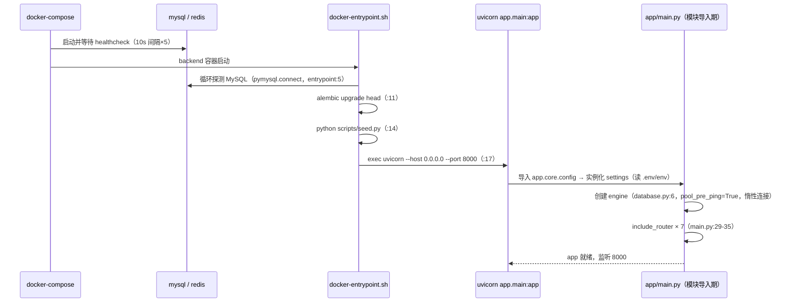

# 7. 模块说明 ｜ 8. 程序启动流程

## 7. 模块说明

本章按「一个模块一节」组织。每个模块给出功能、输入、输出、核心函数/类、依赖与注意事项；源码位置均为可定位引用。

### 7.1 `app/core` —— 横切基础设施

| 文件 | 行数 | 职责 |
|---|---|---|
| `config.py` | 27 | pydantic-settings 定义唯一配置对象 `settings` |
| `database.py` | 16 | `engine`、`SessionLocal`、`Base`、`get_db` 生成器 |
| `security.py` | 35 | bcrypt 哈希/校验、JWT 签发/解码 |
| `deps.py` | 69 | 三个依赖：`get_current_user`、`get_current_active_user`、`verify_api_key` |
| `redis.py` | 5 | **死代码**，全仓零引用 |

**输入/输出**：`Settings()` 在模块导入期实例化（`config.py:27`），从 `.env` 与环境变量读取（`config.py:24`，`case_sensitive=True`）。`get_db` 每个请求产出独立会话，`finally: db.close()`（`database.py:11-16`）。

**核心函数**

| 函数 | 作用 | 关键逻辑 | 异常 |
|---|---|---|---|
| `get_current_user`（`deps.py:13-47`） | 解析 Bearer token 并载入用户 | `HTTPBearer(auto_error=False)` → 无凭证 401；`decode_access_token` 失败 401；`sub` 缺失 401；用户不存在 401 | `HTTPException` 401 |
| `get_current_active_user`（`deps.py:50-59`） | 追加启用校验 | `is_active=False` → **400**（非 403） | `HTTPException` 400 |
| `verify_api_key`（`deps.py:62-69`） | 校验 `X-API-Key` | 头缺失由 FastAPI 直接 422；不匹配 401；明文 `!=` 比较（非常量时间） | `HTTPException` 401 |
| `create_access_token`（`security.py:21-27`） | 签发 JWT | 载荷 `sub` + `exp`（UTC now + `ACCESS_TOKEN_EXPIRE_MINUTES`），HS256 | — |
| `decode_access_token`（`security.py:30-35`） | 解码 JWT | 捕获 `JWTError` 返回 `None`（**签名与过期不作区分**） | — |

**注意**：`config.py:15` 的 `ALGORITHM` 项未被使用，`security.py:10` 硬编码 `"HS256"` → 改配置无效。

### 7.2 `app/models` —— ORM 模型

三个模型 `User`、`LoginLog`、`Alert`，全部继承 `core/database.py:8` 的 `Base`，并**必须**在 `models/__init__.py:1-5` 显式导入（否则 Alembic autogenerate 与 `Base.metadata` 漏表）。字段与索引详见 `06-数据库设计.md`。

公共约定：时间字段使用 Python 侧默认值 `_utcnow()`（`datetime.now(timezone.utc)`，三个模型各自定义一份），`updated_at` 配 `onupdate`（例：`models/alert.py:28`）。

### 7.3 `app/schemas` —— 校验与序列化

| 文件 | 主要模型 | 用途 |
|---|---|---|
| `user.py` | `UserCreate`、`UserLogin`、`UserResponse`、`Token` | 注册/登录/用户输出 |
| `login_log.py` | `LoginLogCreate`、`LoginLogResponse`、`LoginLogQuery` | 上报入参、日志输出；**`LoginLogQuery` 未被任何代码使用** |
| `logs_query.py` | `LogQueryParams`、`LogListResponse` | `GET /api/logs` 的真实查询参数 |
| `alert.py` | `AlertCreate`、`AlertResponse`、`AlertUpdate`、`AlertListResponse` | 告警 |
| `email.py` | `EmailConfigStatus`、`EmailTestResult` | 邮件设置接口输出 |

**关键校验（源码事实）**：

- `LogQueryParams`：`login_status` 正则为 `^(success|failure)$`（`logs_query.py:13`）、`skip ge=0`、`limit 1..100`（`:16-17`）、`start_time > end_time` 抛错（`:19-24`）。
- `AlertUpdate.status` **无枚举约束**（`alert.py:29-30`），任意字符串可写库。

### 7.4 `app/services` —— 业务层

| 文件 | 核心函数 | 说明 |
|---|---|---|
| `auth.py` | `authenticate_user`、`create_admin_user`、`get_user_by_id` | 认证失败抛自定义 `AuthenticationError`（`:9-11`）；创建管理员时重名/重邮箱抛 `ValueError` |
| `logs.py` | `build_log_query`、`get_logs`、`create_log` | 查询构造、分页取数、落库 + 触发异步检测 |
| `detection.py` | `detect_frequency_anomaly`、`detect_device_anomaly`、`should_create_alert` | 两条检测规则 + 去重，见 `04-核心流程与数据流.md` §9.3 |

**模块依赖**：`A(api) → services → models → database(MySQL)`；`services/logs.py:57` 延迟导入 `tasks/detection.py`，形成跨层侧支调用。

**副作用提示**：三个写操作函数内部各自 `db.commit()`（`services/auth.py:40`、`services/logs.py:53`、`services/detection.py:77,146`），**不是**在 API 层统一提交；调用方无法把多个 service 调用包进同一事务。

### 7.5 `app/api` —— HTTP 层

7 个 router 全部在 `app/main.py:29-35` 手动 `include_router`（**无自动扫描**），统一前缀 `settings.API_V1_PREFIX`（=`/api`）。端点清单与详情见 `05-API文档.md`。

| 文件 | 端点 | 特殊之处 |
|---|---|---|
| `health.py` | `GET /health` | 唯一无鉴权端点，返回裸 dict |
| `auth.py` | `login` / `register` / `me` | `register` 需已登录管理员；登录错误统一 401 |
| `logs.py` | `POST/GET/DELETE /logs` | POST 用 API Key，GET/DELETE 用 JWT；DELETE 清空全表 |
| `alerts.py` | 列表/详情/更新/清空 | 更新接受任意 status；清空需 `scope` 必填 |
| `stats.py` | `/stats`、`/stats/alerts` | 返回 camelCase 裸 dict；`/stats` 无 `days` 范围校验 |
| `notifications.py` | `/notifications/stream` | SSE，token 走 query，自带用户校验函数 |
| `settings.py` | `/settings/email`、`/settings/email/test` | 同步 SMTP 调用（`def` → 线程池执行） |

### 7.6 `app/tasks` —— Celery 异步侧支

| 文件 | 内容 |
|---|---|
| `__init__.py` | Celery 实例（broker=backend=`settings.REDIS_URL`）、序列化与 `Asia/Shanghai` 时区、`beat_schedule` 每小时任务 |
| `detection.py` | `detect_anomaly_for_log`（实时单条）、`run_anomaly_detection`（Beat 增量）、`_publish_alert_event`、游标读写 |
| `email.py` | `is_email_configured`、`get_active_admin_emails`、`build_alert_email`、`send_alert_email` |

**重要**：两个任务都用 `try/except` 把所有异常转成返回字符串（`tasks/detection.py:87-88,139-140`），因此**任务失败时 Celery 仍视为成功**，须从返回值或日志排查。

### 7.7 `frontend/` —— Vue3 管理后台（📄已抽样复核）

- 入口链：`index.html` → `src/main.js:24` mount（Pinia → Router → ElementPlus zhCn）→ `App.vue`（含 `OfflineBanner` 与全局设计 Token `App.vue:33-143`，非 scoped）→ `MainLayout` → 5 个视图。
- 网络层：`src/api/index.js` 单例 axios，`baseURL = import.meta.env.VITE_API_BASE_URL || ''`（`:5`，因 `.env` 为 0 字节实际恒为空串）；响应拦截器 `response => response.data`；**401 无条件 `window.location.href='/login'`**（`:22-26`）。
- 状态：`stores/auth.js`（token/username 存 localStorage）、`stores/notification.js`（SSE 连接、未读角标、`ElNotification`）。
- 视图：`Login` / `Dashboard` / `LoginLogs` / `Alerts` / `Settings`；组件 16 个（通用 9 + 图表 5 + 筛选 2）。
- 路由守卫：`router/index.js:45-55` 仅判断 `localStorage.token` 是否存在，**无会话恢复、不调用 `/api/auth/me`**。

### 7.8 `flutter_app/` —— Flutter 客户端（📄已抽样复核）

- 入口链：`lib/main.dart`（`AppConfig.load()` → `ApiClient.loadToken()` → `runApp`）→ `app.dart` 按 `AuthStatus` 分支渲染 → `ShellPage`。
- **无路由库**：页面切换靠 `shell_page.dart:30` 的 `_index` + `IndexedStack`（`:287`），跨页跳转用回调注入（`:45`）。
- 网络：手写 `services/api_client.dart`（10s 超时仅覆盖 `send`）；401 由 `utils/api_guard.dart` 转 `AuthProvider.notifyUnauthorized` 切登录页。
- SSE：条件导出 `sse_client.dart:11`（io 用 `package:http` 流式读取 / web 用 `dart:html` EventSource）。
- 测试与构建：`tool/self_check.dart`（纯 Dart 自检）；未纳入 git 跟踪。

### 7.9 `monitored-app/` —— 被监控系统仿真器

- 入口：`python app.py` → `init_db()` → `app.run(host="0.0.0.0", port=5000, debug=True)`（`app.py:137-139`）。
- 路由：`/`（GET 表单 / POST 登录）、`/welcome`、`POST /api/simulate`（`type=frequency|device`）。
- 上报实现：`report_log()` 向 `${platform_url}/api/logs` 发 `X-API-Key` 请求，5 秒超时，失败静默返回 `False`（`app.py:77-87`）。
- 配置来源：表单隐藏字段 + 页面输入框（`templates/index.html:45-46,103-113`），默认 `platform_url=http://localhost:8000`、`api_key=change-me-to-a-random-api-key-in-production`。
- 存储：本地 SQLite `users.db`，账号为无盐 SHA-256 口令（`app.py:39`、`seed.py:27`）。

---

## 8. 程序启动流程

### 8.1 后端（容器模式，推荐）



要点与坑：

1. **`Settings()` 在模块导入期实例化**（`config.py:27`），配置一旦导入即固定，运行期改 `.env` 不会生效（需重启）。
2. `pydantic-settings` 的 `env_file=".env"` 是**相对当前工作目录**解析，因此本地必须 `cd backend` 后再启动，否则读到的是默认值（详见 `13-开发指南.md` FAQ）。
3. **entrypoint 只等 MySQL，不等 Redis**（`docker-entrypoint.sh:4-8`）；Redis 未就绪时后端能起来，但 `POST /api/logs` 会阻塞（见 `11-性能分析.md` PERF-00）。
4. **entrypoint 硬编码 MySQL 主机/用户/密码/库名**（`docker-entrypoint.sh:5`），与 compose 的 `DATABASE_URL` 重复维护。
5. `alembic/env.py:19` 用 `settings.DATABASE_URL` 覆盖连接串，`alembic.ini:3` 仅作回退。
6. Celery Worker/Beat 使用同一镜像，改由 `command` 覆盖启动命令（`docker-compose.yml:87,112`），**不经 entrypoint**，因此它们不会跑迁移（依赖 backend 先完成）。

### 8.2 后端（本地开发）

```bash
cd backend
uvicorn app.main:app --reload --port 8001        # 开发服务器（README:50）
```
启动后：`/docs`（Swagger UI）、`/redoc` 可用（`main.py:17-18`）；`GET /api/health` 可探活。**注意**：本地 8001 与前端 dev 代理默认 8000 不一致（`frontend/vite.config.js:10,16`），需二选一（见 `13-开发指南.md` FAQ-03）。

### 8.3 前端（Vue）

```bash
cd frontend
npm install
npm run dev        # Vite :5173，代理 /api → localhost:8000
```
初始化链：`main.js` 中 `createApp(App).use(createPinia()).use(router).use(ElementPlus, {locale: zhCn}).mount('#app')`；`App.vue` 渲染 `OfflineBanner` + `router-view`；路由守卫依据 token 放行或跳 `/login`。

### 8.4 客户端（Flutter）

```bash
cd flutter_app
flutter run -d windows      # 或 -d chrome
```
初始化链（📄）：`main.dart` `ensureInitialized` → `AppConfig.instance.load()`（读 `shared_preferences` 键 `api_base_url`，默认 `http://localhost:8001`）→ `ApiClient.loadToken()` → `runApp` → `MultiProvider`(Auth/Notification) → `MiuixTheme.light` → `_Root` 按 `AuthStatus` 分支 → `ShellPage`（`IndexedStack` 承载 4 页，`postFrame` 建立 SSE）。

### 8.5 仿真器

```bash
cd monitored-app
pip install -r requirements.txt
python seed.py      # 建 users.db 并写入 5 个演示账号
python app.py       # Flask :5000（debug=True）
```
演示账号：`zhangsan/lisi/wangwu/zhaoliu`（密码 `123456`）、`admin/admin123`（`monitored-app/seed.py:18-24`，页面亦有展示 `templates/index.html:68-72`）。

### 8.6 启动顺序与依赖矩阵

| 步骤 | 依赖 | 缺失后果 |
|---|---|---|
| MySQL | — | 后端迁移失败、所有查询 500 |
| Redis | — | 上报接口阻塞（PERF-00）、worker/beat 起不来、SSE 无推送 |
| `alembic upgrade head` | MySQL | 表不存在 → 接口 500 |
| `seed.py` | MySQL | 无管理员 → 无法登录（README:33 承诺的 `admin/admin123` 不会存在） |
| uvicorn | MySQL | 启动本身不连库，但首个请求会失败 |
| Celery worker | Redis | 实时检测不执行（日志仍入库，无告警） |
| Celery beat | Redis | 定时增量检测缺失 |
| 前端 dev/build | 后端 | 页面可开，数据为空/报错 |
