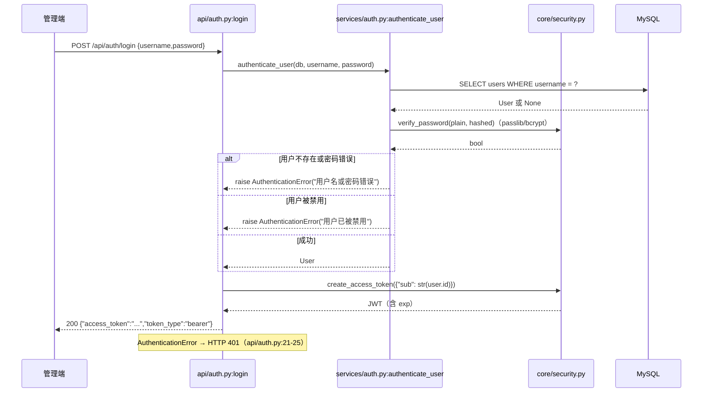
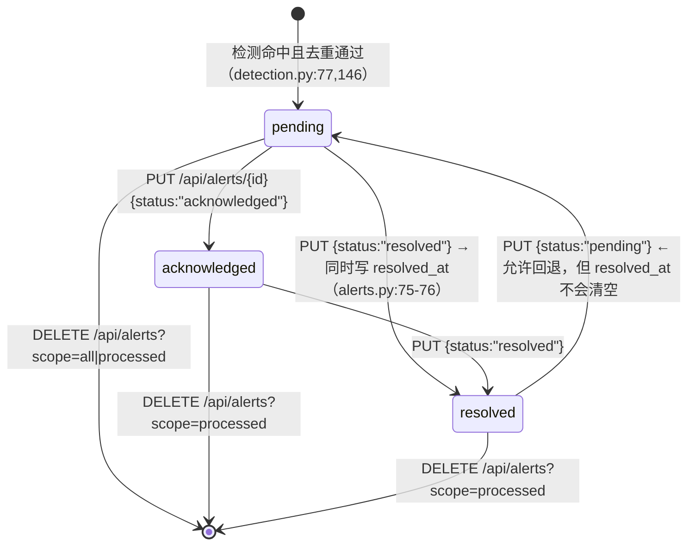

# 9. 核心业务流程 ｜ 10. 数据流 ｜ 11. 核心类 ｜ 12. 核心函数

## 9. 核心业务流程

### 9.1 管理员登录（`POST /api/auth/login`）



后续请求由管理端注入 `Authorization: Bearer <token>`；`core/deps.py:13-47` 解出 `sub` 并回查用户，**每次请求都会查一次 `users` 表**。

### 9.2 日志上报 → 实时异常检测 → 告警 → 推送（核心链路）

```mermaid
sequenceDiagram
    participant MA as monitored-app / 校园系统
    participant API as api/logs.py:receive_log
    participant KEY as core/deps.py:verify_api_key
    participant SVC as services/logs.py:create_log
    participant DB as MySQL
    participant RD as Redis
    participant W as Celery Worker
    participant DET as services/detection.py
    participant SSE as api/notifications.py
    participant UI as 管理端

    MA->>API: POST /api/logs {username,login_time,ip_address,user_agent,login_status,location?}
    API->>KEY: X-API-Key == settings.API_KEY ?
    KEY-->>API: 不匹配→401；头缺失→422
    API->>SVC: create_log(db, data)
    SVC->>DB: INSERT login_logs; commit; refresh
    SVC->>RD: detect_anomaly_for_log.delay(log.id)  ← 在请求线程内（logs.py:58）
    SVC-->>API: LoginLog
    API-->>MA: 201 LoginLogResponse
    RD->>W: 投递任务
    W->>DET: detect_frequency_anomaly(db, log.username, log_id)
    DET->>DB: SELECT login_time FROM login_logs WHERE id=log_id → 窗口终点
    DET->>DB: COUNT(*) 在 [终点-5min, 终点]
    DET->>DET: count≥10 → medium(≤30) / high(>30)（detection.py:55-60）
    DET->>DB: should_create_alert（24h 内同用户同类型 pending 则跳过）
    DET->>DB: INSERT alerts; commit
    W->>DET: detect_device_anomaly(db, log.username, log_id)
    DET->>DB: SELECT DISTINCT user_agent, ip_address 在 [终点-1h, 终点]
    DET->>DET: ≥2 → medium(=2) / high(>2)（detection.py:124-129）
    W->>W: send_alert_email.delay(alert.id)（未配置 SMTP → 直接返回跳过）
    W->>RD: PUBLISH "alerts" {alert_id,type,severity,username}
    RD->>SSE: pubsub.get_message(timeout=1.0)
    SSE-->>UI: data: {"alert_id":..,"type":..,"severity":..,"username":..}
    UI->>UI: 角标 +1 / 弹出提示（两端实现差异见 9.8）
```

**该链路的三个硬约束（源码事实）**：

1. `create_log` 在**请求线程内**调用 `.delay()`（`services/logs.py:58`）→ Redis 不可用时请求无法返回（实测：无限阻塞，见 `11-性能分析.md` PERF-00）。
2. 检测是**异步**的：`POST /api/logs` 返回 201 时告警尚未产生，管理端需通过 SSE 或轮询获知。
3. 检测窗口的终点取自**该条日志的 `login_time`**（`services/detection.py:33-36`），不是服务器当前时间；因此上报历史日志（`login_time` 在过去）也能正确回溯判定。

### 9.3 两条检测规则的完整语义

**频率异常 `frequency`**（`services/detection.py:14-80`）

| 项 | 值 | 位置 |
|---|---|---|
| 窗口 | `[login_time - 5min, login_time]`（实时）／`[now - 5min, now]`（定时） | `:31-41` |
| 触发阈值 | `count >= 10` | `:51-52` |
| 级别 | `count <= 30` → `medium`；`count > 30` → `high` | `:55-60` |
| 统计对象 | `LoginLog.username` **精确等值**，含成功与失败登录（不区分 `login_status`） | `:44-48` |

**设备异常 `device`**（`services/detection.py:83-149`）

| 项 | 值 | 位置 |
|---|---|---|
| 窗口 | `[login_time - 1h, login_time]`（实时）／`[now - 1h, now]`（定时） | `:100-108` |
| 判定对象 | `(user_agent, ip_address)` 组合去重后的**不同取值个数** | `:111-117` |
| 触发阈值 | `device_count >= 2` | `:120-121` |
| 级别 | `=2` → `medium`；`>2` → `high` | `:124-129` |

**去重 `should_create_alert`**（`services/detection.py:152-179`）：条件为 `username` 相同 + `alert_type` 相同 + `status = 'pending'` + `created_at >= now - 24h`；四者全中才拦截。

> 语义提示：`acknowledged`/`resolved` **不阻塞**新告警；`created_at` 用 UTC（`_utcnow`），而「24 小时」由应用侧计算（`:170`），非数据库时间。

### 9.4 定时增量检测（Celery Beat，每 3600 秒）

```text
tasks/__init__.py:18-23  beat_schedule["anomaly-detection-every-hour"]

run_anomaly_detection()                       tasks/detection.py:94-143
 ├─ 1. get_last_check_time()                 读 Redis 键 anomaly_detection:last_check_time
 │     缺失 → now(UTC) - 1h                   :36-42
 ├─ 2. set_last_check_time(now)              ← 先推进游标（:111）
 ├─ 3. SELECT DISTINCT username FROM login_logs
 │     WHERE created_at >= last_check_time    ← 用 created_at 选用户（:114-116）
 ├─ 4. 对每个 username：
 │     detect_frequency_anomaly(db, username)   ← 不传 log_id ⇒ 窗口终点 = now
 │     detect_device_anomaly(db, username)
 └─ 5. 命中 → send_alert_email.delay + _publish_alert_event
```

**两处需要留意的设计**（分析结论）：

- **游标先写后处理**（`:110-111`）：若第 3–5 步抛异常，该窗口的日志将永久不再被增量扫描（异常被 `:139-140` 吞掉，任务仍显示成功）。
- **两个时间字段混用**：选用户用 `created_at`（入库时间），划窗口用 `login_time`（业务时间）。对「补报历史日志」的场景，用户会被选中，但窗口以 `now` 为终点，仍可能命中；对「上报未来时间戳」的数据则可能漏判。此属分析结论，未在真实环境构造验证。

### 9.5 告警处置与数据清理



- **状态值不受约束**（`schemas/alert.py:29-30`）：传入任意字符串都会写库，前端 `typeMap`/`label` 会原样显示未知值。
- **销毁性操作无审计**：`DELETE /api/logs`（清空全部日志，`api/logs.py:50-58`）与 `DELETE /api/alerts`（`api/alerts.py:83-96`）均为物理删除，无软删除、无操作日志、无二次确认（前端有确认框，后端没有）。

### 9.6 统计聚合（`GET /api/stats`、`GET /api/stats/alerts`）

| 指标 | 计算方式 | 位置 |
|---|---|---|
| `todayLogins` | `COUNT(login_logs WHERE login_time >= 今日 00:00)`，日界用 **UTC** | `api/stats.py:23-29` |
| `pendingAlerts` | `COUNT(alerts WHERE status='pending')` | `:32-34` |
| `activeUsers` | 今日有登录记录的 `DISTINCT username` 数 | `:37-39` |
| `loginTrend` | **逐日循环**查询 `days` 次，返回 `[{date:"MM-DD",count}]` | `:42-54` |
| `alertTrend` / `typeDist` / `severityDist` | 同法逐日 + 两次 `GROUP BY` | `:80-105` |

**注意**：`/api/stats` 的 `days` **没有范围校验**（`:18`），而 `/api/stats/alerts` 校验 `1..365`（`:71-72`）——两处不一致，见 `11-性能分析.md` PERF-01。

### 9.7 邮件告警

```text
检测命中 → send_alert_email.delay(alert_id)      tasks/detection.py:73,80
  └─ is_email_configured()?                      tasks/email.py:30-36
       EMAIL_USER 为空 → 跳过
       EMAIL_HOST 含 example.com 或 EMAIL_USER 含 example → 跳过（占位配置）
  └─ get_active_admin_emails(db)                 tasks/email.py:19-27（role=admin 且 is_active）
  └─ build_alert_email(alert, recipients)        :39-56（EmailMessage 纯文本）
  └─ smtplib.SMTP_SSL(host, port)                :83（强制 SSL）
       SMTPException / OSError → logger.error + 返回失败字符串（不抛）
```

`POST /api/settings/email/test`（`api/settings.py:40-77`）走**同一套判断**并额外区分三类失败：`SMTPAuthenticationError` → 账号/授权码错误；`SMTPException` → 发送失败；`OSError` → 无法连接（15 秒超时）。该端点用裸字符串手工拼 MIME（`:56-65`），与 `tasks/email.py` 的 `EmailMessage` 实现不一致。

### 9.8 实时推送（SSE）与两端消费差异

后端：`GET /api/notifications/stream?token=<jwt>`（`api/notifications.py:31-61`）

| 细节 | 实现 |
|---|---|
| 鉴权 | 建流前用 `_get_user_from_token`（`:13-28`）校验 token、用户存在、`is_active` |
| 数据源 | `redis.asyncio.from_url(...)` → `pubsub.subscribe("alerts")`（`:38-42`） |
| 消息格式 | 收到消息输出 `data: <json>\n\n`；无消息时输出 `: heartbeat\n\n` 保活（`:47-53`） |
| 异常处理 | `except Exception: pass`（`:54-55`）—— 任何异常静默终止流 |
| 清理 | `finally` 中 `unsubscribe` + `close` pubsub 与连接（`:56-59`） |
| 推送体字段 | `{alert_id, type, severity, username}`（`tasks/detection.py:20-25`） |

消费端差异（**这是两端行为不一致的关键点**）：

| 端 | 解析方式 | 结果 |
|---|---|---|
| Vue | 读 `alert.type / alert.severity / alert.username`（`stores/notification.js:29-36`） | ✅ 字段匹配，角标与提示均正常 |
| Flutter | `Alert.fromJson(data)`（`providers/notification_provider.dart:45`） | ❌ 事件体无 `id`/`alert_type` → `id` 恒 0、`alertType` 恒空；又因 `shell_page.dart:31,65` 用 `_lastPushSeq=0` 判重，**Snackbar 永不显示**（角标仍自增） |

### 9.9 被监控系统仿真链路

```text
monitored-app 浏览器页面
 ├─ 表单登录（POST /）→ 校验 SQLite 账号 → report_log(login_status="success"/"failed")
 │    失败登录也上报（app.py:59-66）
 └─ 按钮「模拟频率异常×10」/「模拟设备异常」→ POST /api/simulate
       frequency：对 zhaoliu 连续 10 次上报，间隔 8–12 秒随机（app.py:100-112）
       device   ：对 wangwu 依次用 3 组 (ip, user_agent) 上报（app.py:113-129）
```

⚠️ **该链路存在契约破损**：仿真器上报 `login_status="failed"`（`app.py:64,106,125`），而后端查询参数只接受 `success|failure`（`schemas/logs_query.py:13`），前端下拉与种子脚本用的都是 `failure`。结果：仿真器产生的失败日志**在管理端按“失败”筛选不出来**（`?login_status=failed` → 422）。详见 `14-评估与改进.md`。

---

## 10. 数据流

### 10.1 总体数据流

```text
被监控系统 ──(X-API-Key)──> login_logs ──(Celery 检测)──> alerts ──(pub/sub)──> SSE ──> 管理端角标/提示
                                   │                        │
                                   └── GET /api/logs ──┐    └── GET /api/alerts ──┐
                                                       ├──> 管理端表格/图表      │
                                   GET /api/stats ─────┘                          │
告警人工处理：PUT /api/alerts/{id} {status} ──> alerts.status / resolved_at ──────┘
销毁性操作：DELETE /api/logs（全表） ｜ DELETE /api/alerts?scope=all|processed
```

### 10.2 数据形态变换

| 阶段 | 数据形态 | 位置 |
|---|---|---|
| 入口 | JSON body | `LoginLogCreate`（`schemas/login_log.py:6-12`） |
| 落库 | ORM 对象 | `LoginLog(**log_data.model_dump())`（`services/logs.py:51`） |
| 检测入参 | 用户名字符串 + 可选 `log_id` | `services/detection.py:14-18` |
| 告警构造 | Pydantic → ORM | `AlertCreate` → `Alert`（`services/detection.py:67-77`） |
| 推送 | JSON 字符串（**精简字段，非完整响应模型**） | `tasks/detection.py:20-25` |
| 列表响应 | ORM → Pydantic（`from_attributes=True`） | `schemas/alert.py:26`、`schemas/login_log.py:25` |
| 统计响应 | 裸 dict（**camelCase**，与其余接口 snake_case 不一致） | `api/stats.py:56-61`、`:107-111` |

### 10.3 数据生命周期（分析结论，依据为源码中的删除/清理逻辑）

```text
login_logs：写入（上报）→ 长期保留（无归档/无 TTL）→ 仅在调用 DELETE /api/logs 时被整表物理删除
alerts    ：写入（检测）→ 状态流转（pending → acknowledged → resolved）→
            仅在被通知删除时移除：DELETE /api/alerts?scope=processed（已处理）/ scope=all（全部）
            resolved_at 仅在置为 resolved 时写入，且回退状态时不会清空
Redis 键  ：anomaly_detection:last_check_time（检测游标，持久 set，无 TTL）
Redis 频道：alerts（pub/sub，无持久化，SSE 消费者离线期间的消息会丢失）
```

**关键性质（源码事实）**：SSE 基于 Redis pub/sub 且**无消息回放**——管理端离线期间产生的告警不会补推；前端仅在浏览器 `online` 事件时用 `GET /api/alerts` 做一次累加式补拉（📄）。

---

## 11. 核心类

本项目后端以**函数式**为主（`services/`、`api/` 全部是模块级函数），真正的类只有 ORM 模型、配置类与一个自定义异常；前端使用 Vue 组件与 Pinia store，Flutter 使用 ChangeNotifier。

### 11.1 `Settings`（`app/core/config.py:5-27`）

| 项 | 内容 |
|---|---|
| 职责 | 全项目唯一配置来源，基于 `pydantic_settings.BaseSettings` |
| 构造 | 无参；实例在模块导入期创建：`settings = Settings()`（`:27`） |
| 关键属性 | `PROJECT_NAME`、`VERSION`、`API_V1_PREFIX`(="/api")、`DATABASE_URL`、`REDIS_URL`、`SECRET_KEY`、`ACCESS_TOKEN_EXPIRE_MINUTES`(1440)、`ALGORITHM`(未使用)、`API_KEY`、`EMAIL_HOST/PORT/USER/PASSWORD`、`ALERT_EMAIL_FROM` |
| 行为 | `model_config = ConfigDict(env_file=".env", case_sensitive=True)`（`:24`）→ 键名必须大写；文件路径相对 CWD |
| 异常 | 无显式处理；环境变量类型不符时 pydantic 在导入期抛 `ValidationError`（进程启动失败） |
| 调用者 | 几乎所有模块（`database`、`security`、`deps`、`tasks`、`api/settings.py`） |

### 11.2 `User`（`app/models/user.py:12-22`）

| 项 | 内容 |
|---|---|
| 表 | `users` |
| 属性 | `id`(PK,index)、`username`(50,uniq,index,NOT NULL)、`email`(100,uniq,index,NOT NULL)、`hashed_password`(255,NOT NULL)、`role`(20,默认 `"admin"`)、`is_active`(bool,默认 True)、`created_at`、`updated_at`(onupdate) |
| 方法 | 无自定义方法（纯数据模型） |
| 被引用 | `services/auth.py:16,27-42`、`core/deps.py:40`、`api/notifications.py:22`、`tasks/email.py:21-26`、`api/*` 的鉴权依赖 |

### 11.3 `LoginLog`（`app/models/login_log.py:12-27`）

| 项 | 内容 |
|---|---|
| 表 | `login_logs`；表级复合索引 `idx_login_logs_username_login_time(username, login_time)` |
| 属性 | `id`(PK,index)、`username`(50,index,NOT NULL)、`login_time`(NOT NULL)、`ip_address`(45,NOT NULL)、`user_agent`(500,可空)、`login_status`(20,NOT NULL)、`location`(100,可空)、`created_at`、`updated_at` |
| 语义 | `login_time` 是业务时间（上报方提供）；`created_at` 是入库时间（服务端生成）。检测用前者、增量选用户用后者 |
| 被引用 | `services/logs.py`、`services/detection.py:33,44,111`、`api/stats.py`、`tasks/detection.py:9,114` |

### 11.4 `Alert`（`app/models/alert.py:13-32`）

| 项 | 内容 |
|---|---|
| 表 | `alerts`；表级复合索引 `idx_alerts_username_alert_type_status` |
| 属性 | `id`(PK)、`username`(50,index,NOT NULL)、`log_id`(FK→`login_logs.id`,可空,index)、`alert_type`(50,NOT NULL)、`alert_message`(500,NOT NULL)、`severity`(20,NOT NULL)、`status`(20,默认 `pending`)、`created_at`、`updated_at`、`resolved_at` |
| 关系 | `log = relationship("LoginLog", backref="alerts")`（`:32`）→ 反向可由 `LoginLog.alerts` 访问 |
| 被引用 | `services/detection.py:75,144,172`、`api/alerts.py`、`api/stats.py:86,96,102`、`tasks/email.py:71` |

### 11.5 `AuthenticationError`（`app/services/auth.py:9-11`）

| 项 | 内容 |
|---|---|
| 职责 | 业务层表示「认证失败」的语义化异常，避免 service 依赖 FastAPI |
| 产生 | `services/auth.py:18,20`（密码错误 / 用户被禁用） |
| 捕获 | `api/auth.py:21-25` → 转 HTTP 401（**两类原因合并为同一响应码，detail 文案不同**） |

### 11.6 Celery 应用对象（`app/tasks/__init__.py:4-24`）

| 项 | 内容 |
|---|---|
| 名称 | `campus_monitor` |
| broker / backend | 同为 `settings.REDIS_URL`（`:6-7`） |
| include | `app.tasks.email`、`app.tasks.detection`（`:8`） |
| 配置 | JSON 序列化、`timezone="Asia/Shanghai"`、`enable_utc=True`、`beat_schedule` 每小时一次（`:11-23`） |
| 任务 | `detect_anomaly_for_log(log_id)`、`run_anomaly_detection()`、`send_alert_email(alert_id)`（`bind=True`） |

### 11.7 前端与客户端

| 端 | 核心单元 | 职责 |
|---|---|---|
| Vue | `stores/auth.js` | token/username 持久化与登录/登出 |
| Vue | `stores/notification.js` | SSE 连接、未读角标、`ElNotification` 提示、重连 |
| Vue | `composables/useAsyncData.js`、`useTableQuery.js`、`useOnline.js` | 加载态/错误态封装、表格查询状态、在线状态 |
| Flutter | `services/api_client.dart`（单例） | HTTP 方法、鉴权头、错误映射 |
| Flutter | `providers/auth_provider.dart`、`notification_provider.dart` | 会话状态、SSE 与未读 |
| Flutter | `config/app_config.dart` | `api_base_url` 持久化与预设 |

---

## 12. 核心函数

> 说明：下表覆盖后端全部关键函数；「调用者」与「被调用」用于快速定位改动影响面。

### 12.1 `create_log`（`services/logs.py:49-60`）

| 项 | 内容 |
|---|---|
| 作用 | 把上报数据写入 `login_logs` 并触发异步检测 |
| 入参 | `db: Session`、`log_data: LoginLogCreate` |
| 返回 | `LoginLog`（已 refresh，含自增 `id`） |
| 调用者 | `api/logs.py:22`；测试 `tests/test_detection.py`、`tests/test_integration.py` |
| 被调用 | `LoginLog(**model_dump())` → `db.add/commit/refresh`；`detect_anomaly_for_log.delay(log.id)` |
| 副作用 | 写库并提交；向 Redis 投递任务（**请求线程内阻塞点**） |
| 异常 | 无捕获：数据库错误向上抛为 500；Redis 不可用时实测**无限阻塞** |
| 关键逻辑 | 延迟导入 `tasks/detection` 避免循环引用（`:57`） |

### 12.2 `build_log_query` / `get_logs`（`services/logs.py:11-46`）

| 项 | `build_log_query` | `get_logs` |
|---|---|---|
| 作用 | 组装筛选与排序的 Query | 取总数与当页数据 |
| 入参 | `db` + `username/ip_address/login_status/start_time/end_time` | `db, skip, limit, **filters` |
| 返回 | `Query`（已 `order_by(login_time DESC)`） | `tuple[list[LoginLog], int]` |
| 关键逻辑 | `username` 用 `contains()` 模糊；`ip_address` 等值；时间为 `>=` / `<=` | 先 `query.count()` 再 `offset/limit/all()`（两次查询） |
| 调用者 | `get_logs`、（潜在）统计 | `api/logs.py:32` |

### 12.3 `detect_frequency_anomaly`（`services/detection.py:14-80`）

| 项 | 内容 |
|---|---|
| 作用 | 判定 5 分钟窗口内登录次数是否达阈值并建告警 |
| 入参 | `db`、`username`、`log_id: Optional[int]` |
| 返回 | `Alert` 或 `None` |
| 窗口 | 有 `log_id` → 该日志 `login_time` 为终点；否则 `now(UTC)`（`:31-41`） |
| 副作用 | 命中时 `INSERT alerts` + `commit` + `refresh`（`:76-78`） |
| 异常 | 无捕获；DB 异常向上抛（在 Celery 任务中被 `try/except` 兜住） |
| 边界 | `if log_id:` 使 `log_id=0` 退化为定时模式（实际 id 从 1 起，无影响） |
| 调用者 | `tasks/detection.py:70,124`；测试多处 |

### 12.4 `detect_device_anomaly`（`services/detection.py:83-149`）

同上结构；窗口 1 小时；以 `(user_agent, ip_address)` 去重计数；`≥2` 触发（`:120-121`），`=2` medium、`>2` high。

### 12.5 `should_create_alert`（`services/detection.py:152-179`）

| 项 | 内容 |
|---|---|
| 作用 | 告警去重闸门 |
| 入参 | `db`、`username`、`alert_type` |
| 返回 | `bool`（`True` = 可建新告警） |
| 条件 | 同用户 + 同类型 + `status='pending'` + `created_at >= now-24h` 的记录不存在 |
| 调用者 | 两个 `detect_*` 函数（`:63,132`）；测试 |
| 注意 | 使用复合索引 `idx_alerts_username_alert_type_status` 的主要消费者 |

### 12.6 `verify_api_key`（`core/deps.py:62-69`）

| 项 | 内容 |
|---|---|
| 作用 | 上报接口的静态密钥鉴权 |
| 入参 | `x_api_key: str = Header(..., alias="X-API-Key")`（**必填**，缺失由 FastAPI 返回 422） |
| 返回 | 原值字符串 |
| 异常 | 不匹配 → 401 `"Invalid API Key"` |
| 注意 | 明文 `!=` 比较，非常量时间；密钥来自 `settings.API_KEY`（默认 `dev-api-key-change-in-production`） |

### 12.7 `get_current_user` / `get_current_active_user`（`core/deps.py:13-59`）

见 §11 与 `05-API文档.md` §13.2；关键点是**每请求一次用户查询**，以及禁用用户返回 400 而非 403。

### 12.8 `_publish_alert_event`（`tasks/detection.py:16-27`）

| 项 | 内容 |
|---|---|
| 作用 | 把告警事件发布到 Redis 频道 `alerts` 供 SSE 推送 |
| 入参 | `alert`（ORM 对象） |
| 返回 | `None` |
| 副作用 | 新建 Redis 连接 → `publish` → **不关闭连接**（依赖 GC） |
| 异常 | `except Exception: pass`（`:26-27`）——推送失败不影响告警落库 |
| 调用者 | `tasks/detection.py:74,81,128,135` |

### 12.9 `run_anomaly_detection`（`tasks/detection.py:94-143`）

见 §9.4；返回描述字符串，异常被吞（`:139-140`）。

### 12.10 `detect_anomaly_for_log`（`tasks/detection.py:50-91`）

| 项 | 内容 |
|---|---|
| 作用 | 单条日志的实时检测编排 |
| 入参 | `log_id: int` |
| 返回 | 结果字符串（`"No anomaly detected"` / `"Frequency alert created: N; Device alert created: M"` / `"Error during detection: ..."` / `"Log N not found"`） |
| 副作用 | 建告警、投递邮件任务、发 pub/sub |
| 异常 | 全部吞掉转字符串（`:87-88`）→ **worker 日志无 traceback**，须看返回值 |
| 会话 | 自建 `SessionLocal()` 并在 `finally` 关闭（`:61,90-91`） |

### 12.11 邮件相关（`tasks/email.py`）

| 函数 | 作用 | 入参 → 返回 | 关键行为 |
|---|---|---|---|
| `is_email_configured`（`:30-36`） | 判断是否具备真实 SMTP 配置 | 无 → `bool` | `EMAIL_USER` 为空或 host/user 含 `example` → False |
| `get_active_admin_emails`（`:19-27`） | 取收件人 | `db` → `list[str]` | 过滤 `role='admin'` 且 `is_active` 且 email 非空 |
| `build_alert_email`（`:39-56`） | 构造邮件 | `alert, recipients` → `EmailMessage` | 主题含级别/类型/用户名；正文含告警 ID、关联日志 ID |
| `send_alert_email`（`:59-93`） | 发送任务（`bind=True`） | `alert_id` → `str` | 未配置/无收件人/发送失败**均返回字符串而不抛**；SMTP 异常写 `logger.error` |

### 12.12 统计函数（`api/stats.py:16-111`）

| 函数 | 入参 | 返回 | 关键逻辑 |
|---|---|---|---|
| `get_stats`（`:16-61`） | `days: int = 7`（无约束） | 裸 dict（camelCase） | 3 个 count + `days` 次逐日 count |
| `get_alert_stats`（`:64-111`） | `days: int = 7`（校验 1–365，越界 400） | 裸 dict | `days` 次逐日 count + 2 次 `GROUP BY` |

### 12.13 SSE 流函数（`api/notifications.py`）

| 函数 | 作用 | 要点 |
|---|---|---|
| `_get_user_from_token`（`:13-28`） | 复刻 `get_current_user` 的校验逻辑（token → 用户 → is_active） | 与 `core/deps.py` 逻辑重复，**两处需同步维护** |
| `stream_notifications`（`:31-61`） | 建立 SSE 流 | `async def`；持有请求级 DB 会话直到流结束；`except Exception: pass` 会静默结束流 |
