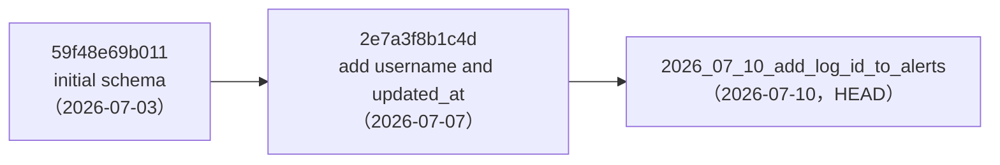
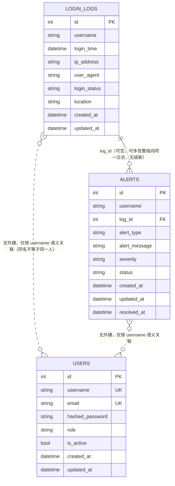

# 14. 数据库设计

> 本章内容来自 ORM 模型与 Alembic 迁移脚本的逐行阅读（**源码事实**）。
> 凡涉及 MySQL 具体行为（外键级联、DDL 在非空表上的执行结果）的结论均标注为**分析结论**——本次审计环境 Docker 守护进程未运行，**未在真实 MySQL 上验证**。

## 14.1 概览

| 项 | 值 | 依据 |
|---|---|---|
| 数据库类型 | MySQL 8.0（容器镜像 `mysql:8.0`） | `docker-compose.yml:5` |
| 库名 | `campus_monitor` | `docker-compose.yml:9` |
| 账号 | `campus_user` / 密码 `<YOUR_PASSWORD>`（compose 中为占位值） | `docker-compose.yml:10-11` |
| 主机端口 | `8881` → 容器 `3306` | `docker-compose.yml:13` |
| 连接串 | `mysql+pymysql://…@<host>:<port>/campus_monitor` | `core/config.py:10`（默认 `3306`，与 Docker 实际 `8881` 不一致，见 `07-配置与依赖.md`） |
| ORM | SQLAlchemy 2.0.51，`declarative_base()` | `core/database.py:8` |
| 引擎参数 | `pool_pre_ping=True`（其余为默认：`pool_size=5`、`max_overflow=10`） | `core/database.py:6` |
| 迁移工具 | Alembic，3 个版本 | `alembic/versions/` |
| 表数量 | 3（`users`、`login_logs`、`alerts`） | `models/__init__.py:1-3` |
| 字符集/排序规则 | **源码中未显式配置**（依赖 MySQL 8.0 默认 `utf8mb4`） | — |
| 时区 | 数据库列为 `DATETIME`（无时区），应用侧写入 UTC | `models/*.py` 的 `_utcnow()` |

## 14.2 迁移链



| 版本 | 内容 | 文件 |
|---|---|---|
| `59f48e69b011` | 建 3 张表：`alerts(user_id, alert_type, alert_message, severity, status, created_at, resolved_at)`、`login_logs`、`users`；建 `ix_users_username/email`（unique）、`ix_login_logs_username`、`ix_alerts_user_id` | `versions/59f48e69b011_initial_schema.py:19-59` |
| `2e7a3f8b1c4d` | `alerts`：删索引 `ix_alerts_user_id` → 删列 `user_id` → 加 `username`(**NOT NULL**) → 加索引 `ix_alerts_username` → 加 `updated_at`；`users`/`login_logs` 各加 `updated_at` | `versions/2e7a3f8b1c4d_add_username_and_updated_at.py:19-31` |
| `2026_07_10_…` | `alerts` 加 `log_id`(可空) + 外键 `fk_alerts_log_id_login_logs`；建复合索引 `idx_alerts_username_alert_type_status`、`idx_login_logs_username_login_time` | `versions/2026_07_10_add_log_id_to_alerts.py:19-40` |

**迁移配置**：`alembic/env.py:19` 用 `settings.DATABASE_URL` 覆盖 `alembic.ini` 中的静态 URL；`alembic.ini:3` 保留 `mysql+pymysql://campus_user:<YOUR_PASSWORD>@localhost:8881/campus_monitor` 作为回退（**明文占位密码**）。容器启动时自动执行 `alembic upgrade head`（`docker-entrypoint.sh:11`）。

⚠️ **迁移风险（分析结论）**：`2e7a3f8b1c4d:23` 新增 `alerts.username` 为 `NOT NULL` 且**未提供 `server_default`**。若目标库 `alerts` 表已有数据，MySQL 在严格模式下该 `ADD COLUMN` 会失败，导致迁移中断。新库（表为空）不受影响。

⚠️ **迁移与模型的一致性提示**：`2e7a3f8b1c4d` 的 `downgrade()` 会重新添加 `user_id` 且声明 `nullable=False`（`:45`），在非空表上回滚同样存在失败风险。

## 14.3 表结构

### 14.3.1 `users`

| 列 | 类型 | 可空 | 默认 | 键/索引 | 说明 |
|---|---|---|---|---|---|
| `id` | Integer | 否 | 自增 | PK，`ix_users_id` | |
| `username` | String(50) | **否** | — | **UNIQUE** `ix_users_username` | 登录名 |
| `email` | String(100) | **否** | — | **UNIQUE** `ix_users_email` | 也用作邮件告警收件地址 |
| `hashed_password` | String(255) | **否** | — | — | bcrypt 哈希（`passlib`） |
| `role` | String(20) | 是 | `'admin'`（Python 侧 default） | — | 无枚举约束；**代码中无权限分支** |
| `is_active` | Boolean | 是 | `True`（Python 侧） | — | 禁用后登录 401、鉴权 400 |
| `created_at` | DateTime | 是 | `_utcnow()`（Python 侧） | — | UTC |
| `updated_at` | DateTime | 是 | `_utcnow()` + `onupdate` | — | UTC |

源码：`models/user.py:12-22`；迁移：`versions/59f48e69b011:47-59`、`versions/2e7a3f8b1c4d:28`。

### 14.3.2 `login_logs`

| 列 | 类型 | 可空 | 默认 | 键/索引 | 说明 |
|---|---|---|---|---|---|
| `id` | Integer | 否 | 自增 | PK，`ix_login_logs_id` | |
| `username` | String(50) | **否** | — | `ix_login_logs_username`；复合索引首列 | 被监控系统的用户名 |
| `login_time` | DateTime | **否** | — | 复合索引次列 | **业务时间**，由上报方提供 |
| `ip_address` | String(45) | **否** | — | — | 45 字符以兼容 IPv6 |
| `user_agent` | String(500) | 是 | — | — | 设备识别依据之一 |
| `login_status` | String(20) | **否** | — | — | **自由字符串**，无约束；实际用值见 `05-API文档.md` §13.5 |
| `location` | String(100) | 是 | — | — | 地域；`seed_logs.py:73` 注明「地理位置字段已弃用」 |
| `created_at` | DateTime | 是 | `_utcnow()` | — | **入库时间**（服务端）；增量检测用它选用户 |
| `updated_at` | DateTime | 是 | `_utcnow()` + `onupdate` | — | 实际无更新路径 |

索引：`idx_login_logs_username_login_time (username, login_time)`（`versions/2026_07_10…:36-40`）——正好服务两条检测规则的窗口查询。

### 14.3.3 `alerts`

| 列 | 类型 | 可空 | 默认 | 键/索引 | 说明 |
|---|---|---|---|---|---|
| `id` | Integer | 否 | 自增 | PK，`ix_alerts_id` | |
| `username` | String(50) | **否** | — | `ix_alerts_username`；复合索引首列 | 冗余存储（不通过 `log_id` 关联取），保证告警在日志被清空后仍可读 |
| `log_id` | Integer | 是 | — | FK → `login_logs.id`，`ix_alerts_log_id` | 实时检测时为触发日志 ID；定时检测时为 `NULL` |
| `alert_type` | String(50) | **否** | — | 复合索引次列 | `frequency` / `device`（裸字符串） |
| `alert_message` | String(500) | **否** | — | — | 面向管理员的自然语言描述 |
| `severity` | String(20) | **否** | — | — | `low` / `medium` / `high`（裸字符串） |
| `status` | String(20) | 是 | `'pending'`（Python 侧） | 复合索引第三列 | `pending` / `acknowledged` / `resolved` |
| `created_at` | DateTime | 是 | `_utcnow()` | — | 去重逻辑的比较列 |
| `updated_at` | DateTime | 是 | `_utcnow()` + `onupdate` | — | |
| `resolved_at` | DateTime | 是 | — | — | **仅**在 `PUT` 设置 `status="resolved"` 时写入（`api/alerts.py:75-76`） |

外键：`fk_alerts_log_id_login_logs (log_id) → login_logs(id)`，**未声明 `ON DELETE`/`ON UPDATE`**（`versions/2026_07_10…:22-26`）→ MySQL 默认 `RESTRICT`（分析结论）。

## 14.4 实体关系



**关系说明（源码事实）**：

- 只有一条物理外键：`alerts.log_id → login_logs.id`；ORM 侧对应 `Alert.log ↔ LoginLog.alerts`（`models/alert.py:32`）。
- **`username` 是普通字符串，不是外键**：`users.username`（平台管理员）与 `login_logs.username` / `alerts.username`（被监控用户）**属于完全不同的命名空间**，只是字段同名。这是最容易误解的一点。
- 同一 `log_id` 可被多条告警引用（例如同一日志同时触发频率与设备告警）。

## 14.5 表与字段的关键性

| 类别 | 表 | 说明 |
|---|---|---|
| 核心表 | `login_logs`、`alerts` | 业务主体，体量最大 |
| 支撑表 | `users` | 仅存管理员账号（预期极小，通常 1–5 行） |
| 关联表 | 无 | 项目未使用多对多关系 |
| 最关键字段 | `login_logs.login_time` | 所有检测窗口与趋势统计的基准；**其取值正确性直接决定检测准确性** |
| 最关键字段 | `login_logs.username` | 检测分组键，无外键校验，脏数据会直接产生错误告警 |
| 最关键字段 | `alerts.status` | 去重与清理逻辑的判定依据（`pending` 阻塞新告警，`processed` 才可清空） |
| 易被误用的字段 | `login_logs.location` | 已弃用（`seed_logs.py:73`），但上报接口仍接受并存储 |
| 易被误用的字段 | `users.role` | 只有默认值和邮件收件人筛选会读它，**无任何鉴权分支使用** |

## 14.6 数据生命周期

```text
login_logs
  写入：POST /api/logs（唯一入口，services/logs.py:49）
  读取：GET /api/logs、GET /api/stats、检测窗口查询
  更新：无业务更新路径（updated_at 实际不会变化）
  删除：DELETE /api/logs → 整表物理删除（api/logs.py:56）
  归档/TTL/分区：源码中未发现

alerts
  写入：检测命中（services/detection.py:77,146）+ generate_mock_data.py（模拟数据）
  更新：PUT /api/alerts/{id}（status、resolved_at）
  读取：GET /api/alerts、GET /api/alerts/{id}、GET /api/stats/alerts
  删除：DELETE /api/alerts?scope=all|processed
  归档：源码中未发现

users
  写入：scripts/seed.py（默认管理员）、POST /api/auth/register
  删除：无接口（源码中未发现）
```

**容量与清理提示（分析结论）**：`login_logs` 无 TTL/归档机制，长期运行会持续增长；唯一的清理手段是清空全表，缺少「按时间范围删除」的中间粒度。

## 14.7 数据一致性观察（分析结论）

| 观察 | 依据 | 影响 |
|---|---|---|
| `alerts.username` 与 `login_logs.username` 无引用完整性约束 | 无外键 | 用户名被改写/日志被清空后，告警仍保留原值（这其实是**有意为之**的设计，用于留存证据） |
| 删除日志会与 `alerts.log_id` 外键冲突 | FK 无 `ON DELETE`，MySQL 默认 RESTRICT | 存在关联告警时 `DELETE /api/logs` 会失败（未实测） |
| `resolved_at` 与 `status` 可能不一致 | `api/alerts.py:73-76` 仅在设为 `resolved` 时写入，回退不清空 | 报表/前端若依据 `resolved_at` 统计会出现偏差 |
| 告警状态可写入任意字符串 | `schemas/alert.py:29-30` 无枚举 | 数据污染，前端只能原样展示 |
| 检测窗口依赖应用时钟 | `services/detection.py:39,106` 用 `datetime.now(timezone.utc)`，DB 无时区列 | 应用与数据库时钟不一致会直接影响定时检测的命中率 |

## 14.8 变更指引（新增字段/表时的固定步骤）

1. 修改/新增 `backend/app/models/*.py`；**新模型必须在 `backend/app/models/__init__.py` 显式 import**（否则 `alembic revision --autogenerate` 与 `Base.metadata` 漏表）。
2. 在 `backend/` 下执行 `alembic revision --autogenerate -m "描述"`，**人工检查**生成的迁移（本项目历史迁移已出现「加 NOT NULL 无默认值」的问题）。
3. 执行 `alembic upgrade head` 应用（不要用 `Base.metadata.create_all()`）。
4. 若字段出现在 API 响应中，同步更新 `schemas/*.py` 并保持 `model_config = ConfigDict(from_attributes=True)`。
5. 同步更新本章与 `05-API文档.md`。
