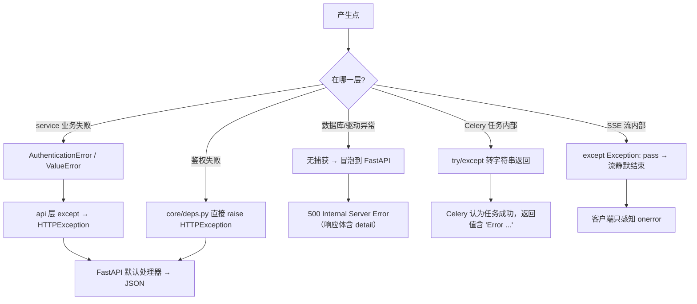

# 17. 异常处理 ｜ 18. 日志系统

## 17. 异常处理

### 17.1 异常体系（源码事实）

| 异常 | 定义位置 | 语义 | 谁抛 | 谁捕获 | 最终响应 |
|---|---|---|---|---|---|
| `AuthenticationError` | `services/auth.py:9-11` | 业务层「认证失败」，避免 service 依赖 FastAPI | `services/auth.py:18,20` | `api/auth.py:21-25` | HTTP **401** |
| `ValueError`（内置） | — | 注册时的用户名/邮箱冲突；查询参数时间范围非法 | `services/auth.py:28,30`、`schemas/logs_query.py:23` | `api/auth.py:38-39`；`LogQueryParams` 由 FastAPI 转 422 | 400（注册）/ 422（查询） |
| `HTTPException` | FastAPI | HTTP 语义异常 | `core/deps.py:19,27,35,42,55,65`、`api/auth.py:22,39`、`api/alerts.py:56,70`、`api/notifications.py:16,20,24,26`、`api/stats.py:72` | FastAPI 全局处理器 | 对应状态码 + `{"detail": ...}` |
| `JWTError` | `python-jose` | token 解码失败（含过期） | `jwt.decode` | `core/security.py:34-35` → **返回 `None`** | 上层转 401（**不区分过期与伪造**） |
| `smtplib.SMTPAuthenticationError` / `SMTPException` / `OSError` | 标准库 | 邮件发送失败 | `smtplib` | `api/settings.py:72-77`（分类返回）、`tasks/email.py:87-89`（记录并返回） | 200 + `success=false` / 任务返回字符串 |
| `Exception`（兜底） | — | 未知异常 | 任意 | `tasks/detection.py:26,87,139`、`api/notifications.py:54` | 见 §17.3 |

**数量统计（实测 grep）**：`raise` 语句共 31 处（`except` 与 `raise` 合计命中 31 行）。其中 `HTTPException` 15 处、业务异常 2 处、`ValueError` 3 处。

### 17.2 异常的传播与捕获路径

### 17.3 四类「吞异常」点（需要特别留意）

| 位置 | 写法 | 后果 | 风险级别 |
|---|---|---|---|
| `tasks/detection.py:87-88` | `except Exception as e: return f"Error during detection: {str(e)}"` | 实时检测任何失败都被隐藏，任务状态为 SUCCESS，**worker 日志无 traceback** | **高**（问题静默） |
| `tasks/detection.py:139-140` | 同上（定时检测） | 定时检测失败同样静默，且**游标已提前推进**（`:111`）→ 该窗口永久漏检 | **高** |
| `tasks/detection.py:26-27` | `except Exception: pass` | pub/sub 推送失败静默（此处设计上有意容忍，因为落库才是主流程） | 低（可接受） |
| `api/notifications.py:54-55` | `except Exception: pass` | SSE 流中任何异常静默结束，客户端只能靠 `onerror` 感知；且无日志 | 中 |

### 17.4 HTTP 状态码使用现状

| 状态码 | 出现位置 | 语义 |
|---|---|---|
| 200 | 绝大多数成功响应 | |
| **201** | `api/logs.py:15`（`status_code=201`） | 日志创建成功（实测断言通过） |
| **400** | `api/auth.py:39`（注册冲突）、`core/deps.py:55-58`（用户被禁用）、`api/stats.py:72`（`days` 越界） | 语义不统一：**用户被禁用返回 400 而非 401/403** |
| 401 | 鉴权失败（`core/deps.py:19,27,35,42,65`、`api/auth.py:22`、`api/notifications.py:16-26`） | |
| 404 | `api/alerts.py:56,70`（告警不存在） | |
| 422 | FastAPI 自动（缺字段、缺 `X-API-Key` 头、`login_status` 正则不符、`limit` 越界、缺 `scope`） | **实测**：`test_post_log_missing_api_key` 断言 422 |
| 500 | 未捕获异常（数据库错误、Redis 相关等） | 无自定义 500 处理器 |

**响应文案语言不一致**：401 的 `detail` 多为中文（`"未提供认证凭证"`、`"Token 无效或已过期"`），而 404 为英文（`"Alert not found"`），`verify_api_key` 为英文（`"Invalid API Key"`）。

### 17.5 异常处理设计存在的问题（分析结论）

| # | 问题 | 依据 | 影响 | 建议 |
|---|---|---|---|---|
| E1 | 任务级全量吞异常，无日志、无重试、无失败信号 | `tasks/detection.py:87,139` | 检测静默失效，只能靠比对数据量发现 | `logger.exception` + `self.retry()` + 任务失败告警 |
| E2 | 定时任务「游标先写后处理」与吞异常叠加 | `tasks/detection.py:110-111,139` | 失败窗口永久丢失，且无痕迹 | 处理成功后再推进游标；失败保留原游标 |
| E3 | SSE 流异常静默结束 | `api/notifications.py:54` | 实时推送中断无任何服务端记录 | 记录 WARNING 日志并按需重订阅 |
| E4 | 无全局异常处理器 | `main.py` 未注册 `exception_handler` | 500 响应体形态由框架决定，且缺少统一错误码体系 | 增加统一异常处理器与错误码规范 |
| E5 | 无请求级 trace id | 全仓无中间件 | 跨 Celery/SSE/多服务排查困难 | 引入 trace id 并透传到任务载荷 |
| E6 | 数据库异常无分类处理 | 无 `IntegrityError`/`OperationalError` 捕获 | 如 `DELETE /api/logs` 触发外键约束时直接 500，用户得不到可理解的提示 | 捕获并转 409/400 + 明确文案 |
| E7 | 认证失败原因合并为 401 | `api/auth.py:22-25`、`core/security.py:34` | 「密码错误」「账号被禁用」「token 过期」对客户端不可区分，前端无法给出准确提示 | 细化错误码（保持对外信息最小化与安全性的平衡） |

---

## 18. 日志系统

### 18.1 现状（源码事实）

| 项 | 现状 | 依据 |
|---|---|---|
| 日志框架 | 标准库 `logging` | `tasks/email.py:3`、`api/settings.py:2` |
| logger 定义 | **仅 2 个模块**：`tasks/email.py:16`、`api/settings.py:14` | 实测 grep |
| 日志调用总数 | **5 处**：`tasks/email.py:63,77,88`（warning/warning/error）、`api/settings.py:67`（info） | 实测 grep |
| 全项目日志配置 | **不存在**：无 `logging.config.dictConfig`、无 `basicConfig`、无 `logging.ini`/`log_config.yaml` | 实测 grep |
| 实际日志输出来源 | uvicorn / celery 自带的默认配置（控制台） | 框架行为 |
| Alembic 日志 | `alembic.ini:5-36` 定义了 root/sqlalchemy/alembic 三个 logger（root=WARN、alembic=INFO，输出 stderr） | 仅作用于迁移命令 |
| 请求访问日志 | 无自定义中间件；依赖 uvicorn 默认 access log（容器内输出到 stdout） | — |
| 结构化日志 | **源码中未发现**（无 JSON 格式、无字段化输出） | — |
| 分布式追踪 | **源码中未发现**（无 OpenTelemetry/Jaeger 等） | — |
| 错误追踪服务 | **源码中未发现**（无 Sentry 等 SDK） | — |
| 日志落盘 | **源码中未发现**（无日志文件路径配置；容器内 stdout 由 Docker 收集） | — |
| 敏感信息过滤 | **源码中未发现**（无脱敏过滤器）；已知会记录收件人邮箱列表（`api/settings.py:67`）与告警 ID | — |

### 18.2 覆盖缺口（哪些关键路径没有任何日志）

| 路径 | 现状 | 影响 |
|---|---|---|
| `POST /api/logs` 上报成功/失败 | 无日志 | 无法从日志判断「某校系统是否还在上报」 |
| 异常检测命中/未命中 | 无日志（仅 Celery 任务返回值） | **检测是否在工作不可观测**（结合 E1/E2 更严重） |
| `DELETE /api/logs`、`DELETE /api/alerts` 销毁性操作 | 无日志 | 数据被清空后无任何痕迹，**不符合安全审计平台自身的定位** |
| 登录成功/失败 | 无日志 | 无法发现管理员账号被爆破（且接口本身也无速率限制） |
| 邮件跳过（未配置 SMTP） | 有 `logger.warning`（`tasks/email.py:63,77`） | 这是全项目记录最完整的路径 |
| SSE 连接建立/断开/异常 | 无日志 | 实时推送故障排查困难 |

### 18.3 改进建议（按优先级）

1. **建立统一日志配置**：在 `app/main.py` 或独立的 `core/logging.py` 中配置格式（含时间、级别、logger 名、trace id），级别由环境变量控制。
2. **补齐安全审计日志**：至少覆盖「管理员登录成败」「销毁性操作（谁、何时、删了多少）」「告警状态变更」。这是安全审计平台的**基本要求**——本平台监控别人的登录，却不记录自己的关键操作。
3. **任务失败必须留痕**：把 `except Exception as e: return ...` 改为 `logger.exception(...)` + 返回值同时保留。
4. **不在日志中输出敏感信息**：现有 `logger.info("Test email sent successfully to %s", recipients)`（`api/settings.py:67`）会记录全部管理员邮箱，建议改为数量。
5. **接入错误追踪**（可选）：为未捕获异常与任务失败接入 Sentry 类服务，替代「靠人看返回值」。
